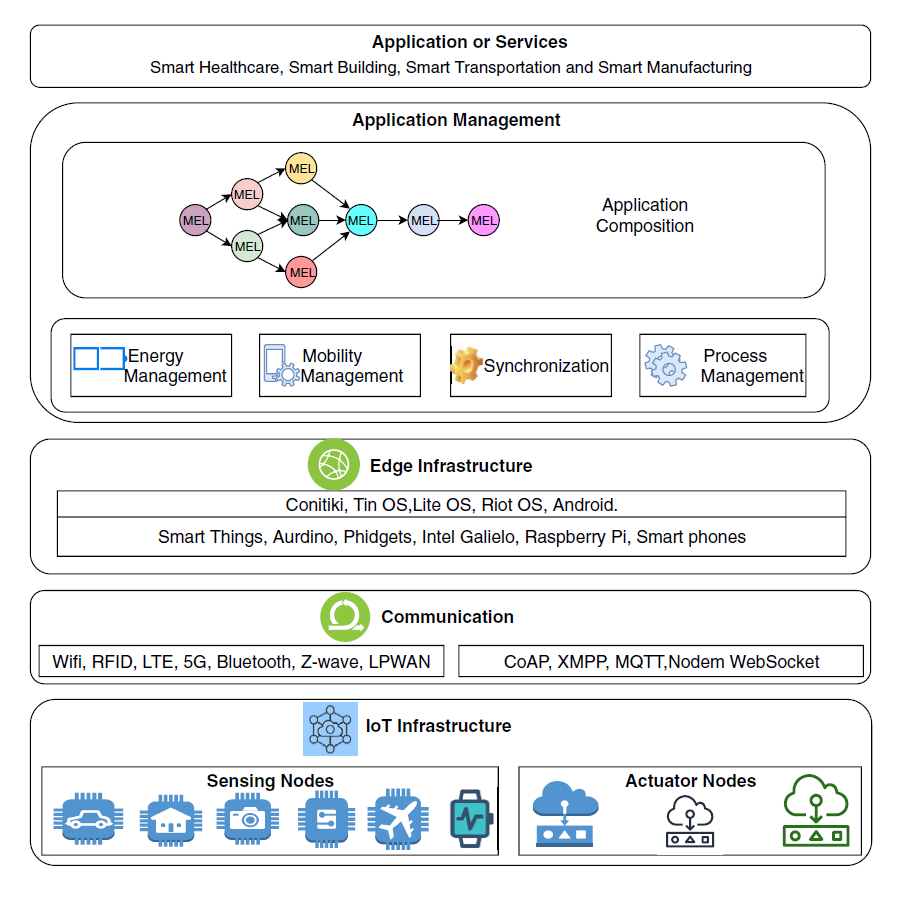
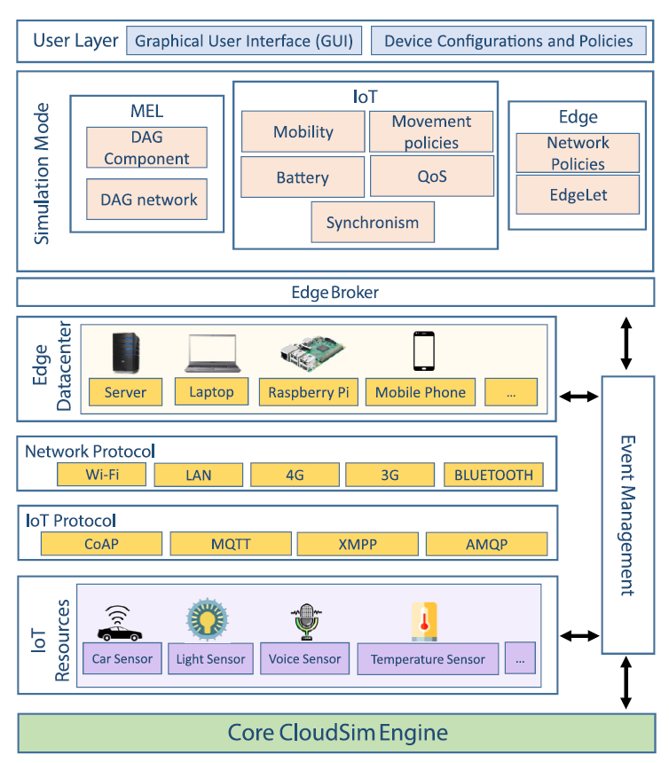

# Simulators

## EdgeCloudSim

[An environment for performance evaluation of edge computing systems](https://doi.org/10.1002/ett.3493)

- Venue
  - Transactions on Emerging Telecommunications Technologies
- Date
  - 06 August 2018
  
## PureEdgeSim

[A simulation toolkit for performance evaluation of cloud, fog, and pure edge computing environments](https://doi.org/10.1109/HPCS48598.2019.9188059)

- Venue
  - 2019 International Conference on High Performance Computing & Simulation (HPCS)
- Date
  - 15 July 2019

## IoTSim-Edge

[A simulation framework for modeling the behavior of Internet of Things and edge computing environments](https://doi.org/10.1002/spe.2787)

- Repository
  - 
- Venue
  - Software: Practice and Experience
- Date
  - 07 January 2020

### Motivation

Edge computing:
- close coupling between request and response
- delay incurred by centralized cloud-based deployment is unacceptable for latency-sensitive application
- network failure and data loss
- battery lifecycle of IoT device when sending all the data

Chanllges: diversity of devices, data formats, communication mediums, application scope, functional complexity, and programming models.

**Why not real-world deployment?** cost of setup and maintenance, controllability of devices in dynamic environment.

### Features

- **application composition** (DAG modeling);
- **edge communication protocol** (both application and transfer layers);
- mobility of IoT devices (handoff between fixed edge devices and moving IoT devices, moving speed and singla range)
- **battery drainage** (monitor the battery consumption)

### Architecture

Application management layer will manage the applications deployed in the edge environment. This layer is responsible for the application composition where an application is decomposed into a DAG of MELs, which abstracts both software and data.

- on the top of CloudSim
- communication among subscribed components (eg, broker, edge datacenter, and IoT resources) using an event management system
- edge datacenter consists of heterogeneous processing devices such as smartphone, laptop, Raspberry Pi, and single-server machine
- edge-IoT management layer consists of several components such as EdgeLet, policies, mobility, battery, synchronism, QoS, network protocols, communication protocols, transport protocols, and security protocols.

# Other Simulators

SimIoT 
  - has
    - multiuser submission
    - modeling of communication between IoT devices and cloud datacenter
  - has no 
    - edge devices
    - heterogeneity of devices
    - energy consumption

COOJA
  - has
    - cross-level simulation of deployment at machine code instruction set level, operating system level, and network level
    - heterogeneous network nodes
  - has no
    - support for other platforms (only Contiki supported)

iFogSim
  - has
    - modeling of Fog and IoT (fog devices can be regarded as edge devices)
    - resource management in network congestion, latency, cost, and energy consumption
  - has no
    - edge communication protocols

IoTSim
  - has
    - map-reduce modeling of big data processing
  - has no
    - edge simulation

# Relevant Papers

- Dolui K, Datta SK. Comparison of edge computing implementations: fog computing, cloudlet and mobile edge computing. 2017 IEEE Global Internet of Things Summit (GIoTS); 2017, 1–6.
- ShiW, Dustdar S. The promise of edge computing. Computer. 2016: 49(5):78-81.
