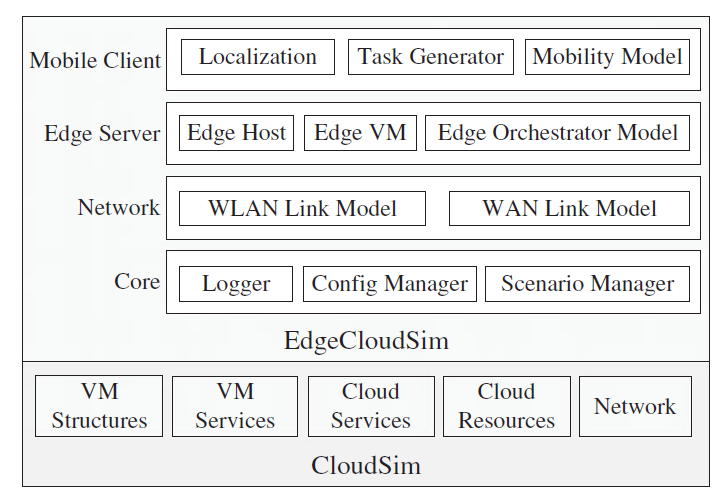
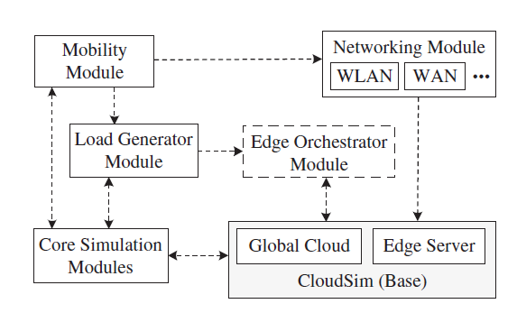
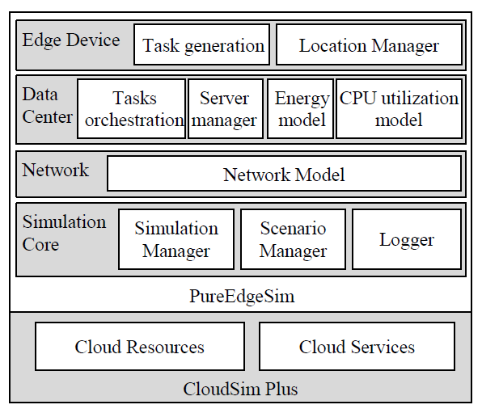

# Edge Computing Simulators

## EdgeCloudSim

[An environment for performance evaluation of edge computing systems](https://doi.org/10.1002/ett.3493)

- Repository
  - https://github.com/CagataySonmez/EdgeCloudSim
- Venue
  - Transactions on Emerging Telecommunications Technologies
- Date
  - 06 August 2018

### Motivation

- using a real cloud environment is not a cost-effective option due to the deployment requirements.
- working on the experimental test beds brings in difficulties regarding the repeatability of the experiments and scalability of the proposed architectures

Chanllenges:
- virtualized resources: integrating a computationalmodel of the virtualized resources and the fog devices requires more complex application models
- mobility: mobility of edge/fog devices affects many other modules.
- network: the interactions among the users, edge nodes, and the cloud may require different access technologies and topologies, such as Wi-Fi, Bluetooth, 4G, and 5G
- extensibility: to customize and extend the modeling tool according to their requirements
- the ease of analysis: logs and output format

### Features

A modular architecture to provide support for a variety of crucial functionalities:
  - **network modeling** specific to WLAN and WAN
  - **device mobility model**
  - **realistic and tunable load generator**
  - **edge orchestrator** module to enable its users to model the orchestration actions

### Architecture

  
<i>EdgeCloudSim Architecture</i>

- The core simulation module 
  - is mainly responsible for loading and running the edge computing scenarios from the configuration files
- The edge orchestrator module fulfills the orchestration process.
  - edge orchestrator makes critical decisions such as creating new replicas, terminating the edge VMs, managing the computational resources of hosts, and offloading the tasks to the cloud or edge servers. It should collect information from the other entities to make the decision process more efficient.
- The networking module
  - handles the transmission delay in the WLAN and WAN by considering both upload and download data.
- The mobility module
  - each mobile device has x and y coordinates that are updated according to the dynamically managed hash table. In the current version, the mobile devices move according to the nomadic mobility model, but it can be extended to a different model according to the simulation scenario to be planned.
- The load generator module
  - is responsible for generating tasks for the given application configuration.

  
<i>EdgeCloudSim Modules</i>

### Use steps

- modeling the application (scenarios)
- modeling the mobility of devices
- modeling the network delay
- modeling the edge computing architectures
  
## PureEdgeSim

[A simulation toolkit for performance evaluation of cloud, fog, and pure edge computing environments](https://doi.org/10.1109/HPCS48598.2019.9188059)

- Repository
  - https://github.com/CharafeddineMechalikh/PureEdgeSim/
- Venue
  - 2019 International Conference on High Performance Computing & Simulation (HPCS)
- Date
  - 15 July 2019

### Motivation

no simulation tool capable of modeling Pure Edge Computing environments, which includes
- offloading the tasks between edge devices and balancing their load
- simulating their heterogeneity
- measuring their energy consumption and their resources utilization

### Features

- simulation of resource management strategies
- **performance evaluation of Cloud, Fog, and Pure Edge environments** in terms of
  - delays
  - energy consumption
  - network congestion
  - resource utilization
  - task success rate
- thousands od device (scalability)
- device heterogenity
  - fix or mobile
  - battery or power supply
  - latency requirement
- **tasks orchestrator module** that manages the available resources, balances the workload, and enables the simulation of multi-tiers scenarios where many computing paradigms can be used in conjunction with one another
- **real time charts**

### Architecture

  
<i>PureEdgeSim Architecture</i>

- extension from CloudSim Plus
  - parallel simulation using all available CPU cores
  - aspects of cloud computing such as resources and services

- modules
  - simulation manager:
    - initiating and managing the simulation environment, scheduling events, and generating the output files
    - logger
  - datacenter manager:
    - Edge Data Center: specific properties of edge devices and their corresponding methods such as the location, the mobility, energy source, battery capacity
    - Server Manager: different servers and devices, their hosts, and their virtual machines according to the configuration
  - task generator:
    - generating tasks: size, CPU utilization, latency requirement
    - extensibility
  - location manager:
    - manage location and mobility
  - network manager:
    - bandwidth
  - task orchestration module
    - desicion maker that determines whether to offload task and where to offload it
    - extensibile with own policies
  - scenario manager
    - configuration of adjustable parameters

  
<i>PureEdgeSim Modules</i>

## IoTSim-Edge

[A simulation framework for modeling the behavior of Internet of Things and edge computing environments](https://doi.org/10.1002/spe.2787)

- Repository
  - https://github.com/DNJha/IoTSim-Edge
- Venue
  - Software: Practice and Experience
- Date
  - 07 January 2020

### Motivation

Edge computing:
- close coupling between request and response
- delay incurred by centralized cloud-based deployment is unacceptable for latency-sensitive application
- network failure and data loss
- battery lifecycle of IoT device when sending all the data

Chanllges: diversity of devices, data formats, communication mediums, application scope, functional complexity, and programming models.

**Why not real-world deployment?** cost of setup and maintenance, controllability of devices in dynamic environment.

### Features

- **application composition** (DAG modeling);
- **edge communication protocol** (both application and transfer layers);
- mobility of IoT devices (handoff between fixed edge devices and moving IoT devices, moving speed and singla range)
- **battery drainage** (monitor the battery consumption)

### Architecture

  
<i>IoT Edge Computing Architecture</i>

Application management layer will manage the applications deployed in the edge environment. This layer is responsible for the application composition where an application is decomposed into a DAG of MELs, which abstracts both software and data.

  
<i>IoTSim-Edge Architecture</i>

- on the top of CloudSim
- communication among subscribed components (eg, broker, edge datacenter, and IoT resources) using an event management system
- edge datacenter consists of heterogeneous processing devices such as smartphone, laptop, Raspberry Pi, and single-server machine
- edge-IoT management layer consists of several components such as EdgeLet, policies, mobility, battery, synchronism, QoS, network protocols, communication protocols, transport protocols, and security protocols.

# Other Simulators

CloudSim/CloudSim plus is the base of the above edge computing simulators.
As be claimed in EdgeCloudSim, "the main drawbacks of CloudSim from the point of view of edge computing are (i) lack of the dynamic WLAN and WAN communication models, (ii) lack of the mobile nodes and mobility support in general, and (iii) lack of the realistic edge type load generator model."

SimIoT 
  - has
    - multiuser submission
    - modeling of communication between IoT devices and cloud datacenter
  - has no 
    - edge devices
    - heterogeneity of devices
    - energy consumption

COOJA
  - has
    - cross-level simulation of deployment at machine code instruction set level, operating system level, and network level
    - heterogeneous network nodes
  - has no
    - support for other platforms (only Contiki supported)

iFogSim
  - has
    - modeling of Fog and IoT (fog devices can be regarded as edge devices)
    - resource management in network congestion, latency, cost, and energy consumption
  - has no
    - edge communication protocols
    - mobility of devices

IoTSim
  - has
    - map-reduce modeling of big data processing
  - has no
    - edge simulation

# Relevant Papers

- Dolui K, Datta SK. Comparison of edge computing implementations: fog computing, cloudlet and mobile edge computing. 2017 IEEE Global Internet of Things Summit (GIoTS); 2017, 1–6.
- ShiW, Dustdar S. The promise of edge computing. Computer. 2016: 49(5):78-81.
